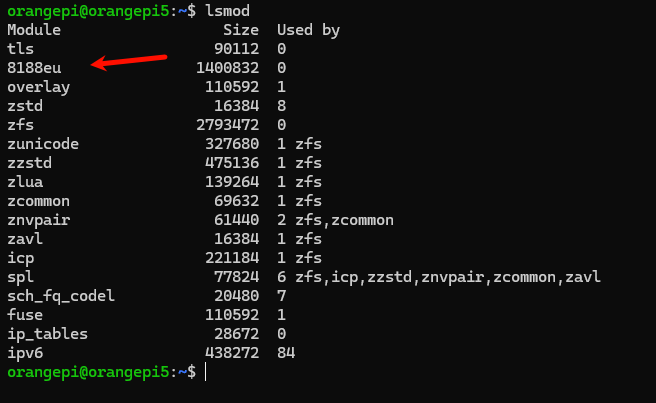

# 开始
OrangePi 5 可以使用以太网接口，wifi模块，USB无线网卡链接网络

# 以太网
直接使用网线将OrangePi 5 和路由器连接即可，据官方手册，它会自动获取Ip地址，可以使用HDMI显示器等方式获取OrangePi 5 的IP地址。
当获取到地址后，可以使用ssh在windowsPC或LinuxPC中连接OrangePI。
如：```ssh orangepi@192.168.8.189 ```

# WIFI模块
暂无

# USB 无线网卡
在OrangePI的终端中，输入 ```lsmod ```可以查看是否加载了USB无线网卡，这需要自己知道无线网卡的型号以及官方是否适配该型号的无线网卡。
如，我的USB无线网卡为rtl8188eu,在OrangePI中可以查看到：参考官方手册第212页


在确认网卡已经加载后，可以使用命令连结WIFI：
 - 1.扫描附近wifi ```nmcli dev wifi ```即可获取当前可用wifi列表，
 - 2.链接wifi ``` sudo nmcli dev wifi connect wifi_name password wifi_passwd```,其中wifi_name和wifi_passwd需要替换
为自己需要链接的wifi名和密码。
 - 3.使用``` ipaddr ``` 可以查看当前wifi所获取的ip地址，其中带有 'wl'字样的网卡既是USB网卡。

