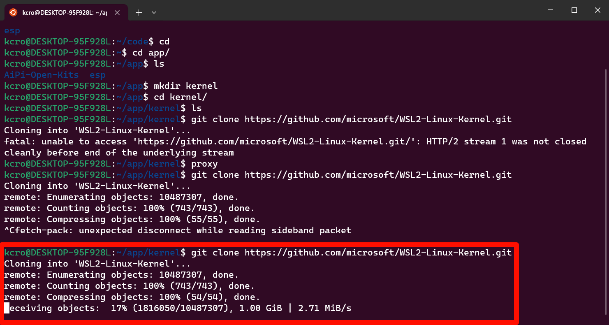

# 内核编译

## 添加USB驱动
1.克隆微软内核镜像
>    

2.安装库
> ```sudo apt install libncurses-dev```

3.编辑配置文件
> ```sudo make menuconfig KCONFIG_CONFIG=Microsoft/config-wsl```
> 进入Device Drivers -> USB support -> Support for Host-side USB ，
> 选中 USB Mass Storage support和弹出的所有驱动

4.安装编译工具
> ```sudo apt install build-essential flex bison libssl-dev libelf-dev dwarves```

5.进入源码目录
> 执行 ```sudo make -j$(nproc) bzImage KCONFIG_CONFIG=Microsoft/config-wsl```


6.注意事项
> 如果提示 bc not found，则需要安装bc
> ```sudo apt-get install bc```
> 然后重新编译


7.编译完成
> 将bzImage文件复制到windows下，在C:/Users/<username>下新建.wslconfig文件，填入以下内容：
> ```
> [WSL2]
> kernel=path/to/your/file # 此为内核路径，即bzimage文件的路径
```