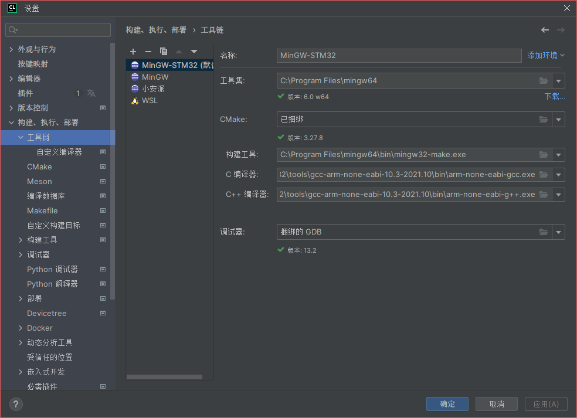
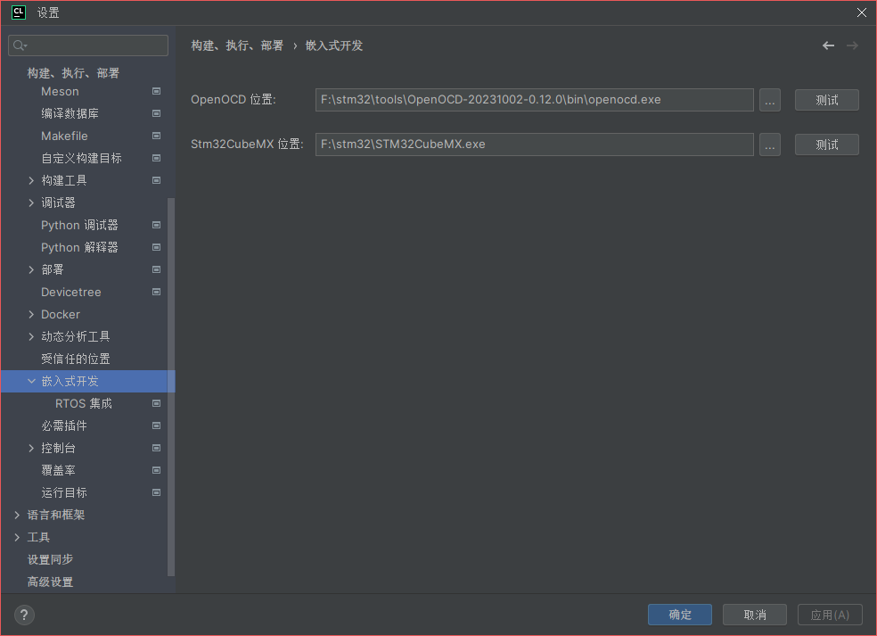
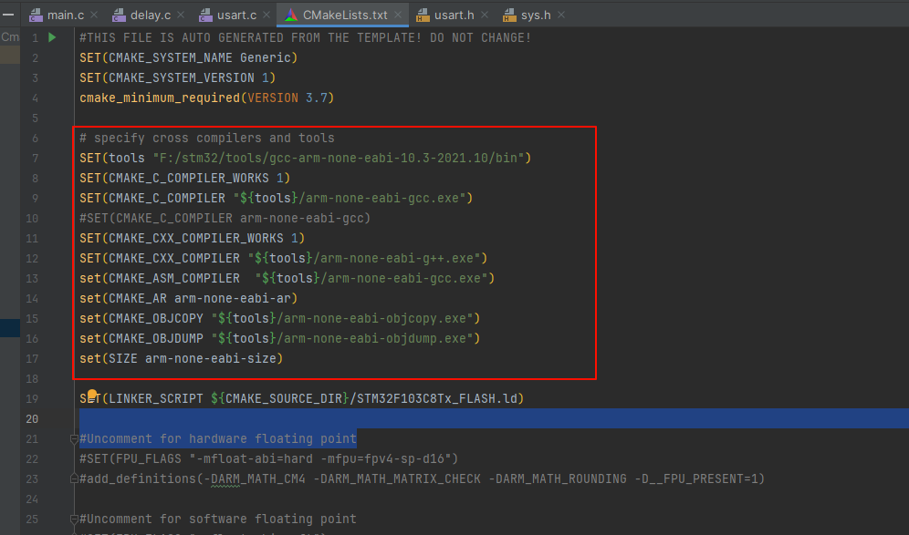
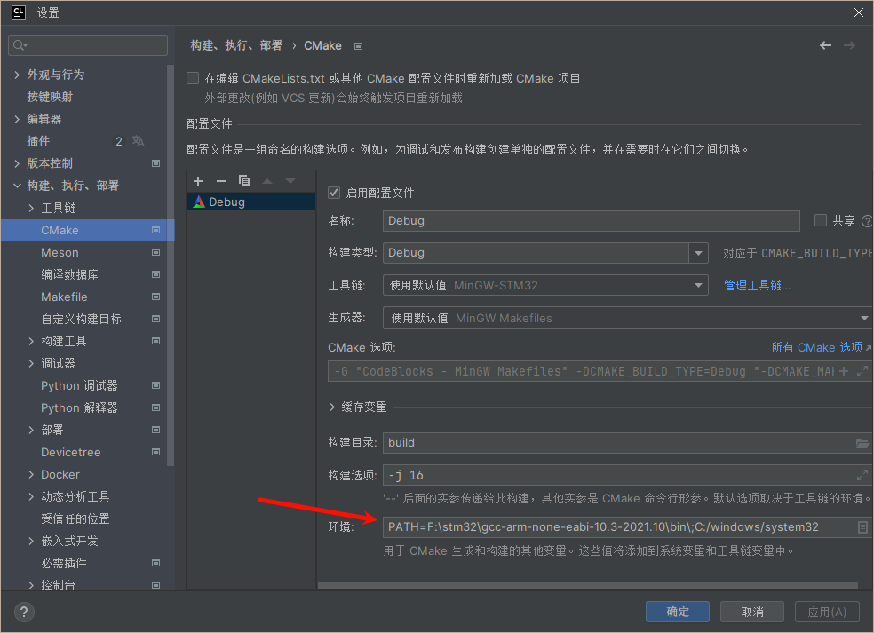
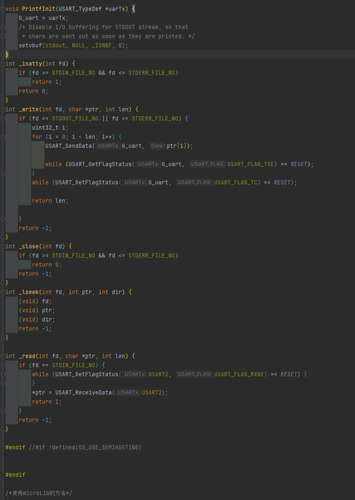
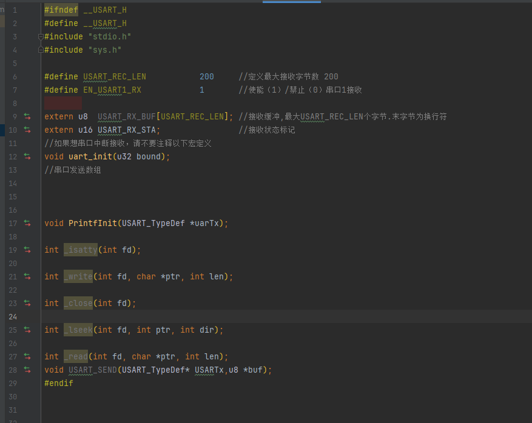

# 简介

此篇为STM32F103的学习笔记，错误之处还望指正，谢谢。


# 1.环境搭建
## 1.1 硬件准备

- STM32F103RCT6最小系统板

## 1.2 软件准备
由于网上众多教程包括原子哥的教程在内，都是用keil5来进行开发，但是考虑到以后会学习到更加复杂的开发环境，所以我决定使用Clion + cmake进行开发。
## 1.3 开发环境搭建

- 安装Clion

> Clion的安装我就不在这里赘述了，网上教程很多。

环境配置
> - [arm-gcc 工具链](https://developer.arm.com/downloads/-/gnu-rm) 下载.zip格式
> - [OPEN-OCD](https://gnutoolchains.com/arm-eabi/openocd/)

将工具链解压到文件夹，最好放在统一的toolchains文件夹下，方便管理。
1.打开Clion，点击文件->设置->构建、执行、部署->工具链

在工具链中新建mingw-stm32，然后工具集选Mingw，构建工具选mingw的cmake.exe，C编译器选下载的arm-gcc,C++同理，调试器不改，然后应用。

在文件->设置->构建、执行、部署->嵌入式开发中，选择openocd的位置，点击应用。

## 1.4 例程文件
例程在[STM32/STM32F103/src/code](./src/code/temp)目录下，用Clion打开目录，主要修改`CMakeLists.txt`文件。如图：

主要修改工具链为你自己安装的位置。修改后重新加载CmakeList.txt，然后就能编译了。
或者在用户环境变量中加入编译链位置和 ```C:/windows/system32```
如：```PATH=F:\stm32\gcc-arm-none-eabi-10.3-2021.10\bin\;C:/windows/system32```


## 1.5 Printf重定向问题

在STM32F103中，printf函数默认是使用USART1来打印的，在keil下重载fputc函数即可打印串口数据，但是在CLion下，由于链接的stdio.h不同，需要重载的函数也不太一样，以正点原子的STM32F103标准例程为例，在USART.c中，修改如图：


代码如下：
``` #if !defined(OS_USE_SEMIHOSTING)

#define STDIN_FILE_NO 0
#define STDOUT_FILE_NO 1
#define STDERR_FILE_NO 2

USART_TypeDef *G_uart;

void PrintfInit(USART_TypeDef *uarTx) {
    G_uart = uarTx;
    /* Disable I/O buffering for STDOUT stream, so that
     * chars are sent out as soon as they are printed. */
    setvbuf(stdout, NULL, _IONBF, 0);
}
int _isatty(int fd) {
    if (fd >= STDIN_FILE_NO && fd <= STDERR_FILE_NO)
        return 1;
    return 0;
}
int _write(int fd, char *ptr, int len) {
    if (fd == STDOUT_FILE_NO || fd == STDERR_FILE_NO) {
        uint32_t i;
        for (i = 0; i < len; i++) {
            USART_SendData(G_uart, ptr[i]);

            while (USART_GetFlagStatus(G_uart, USART_FLAG_TXE) == RESET);
        }
        while (USART_GetFlagStatus(G_uart, USART_FLAG_TC) == RESET);

        return len;

    }
    return -1;
}
int _close(int fd) {
    if (fd >= STDIN_FILE_NO && fd <= STDERR_FILE_NO)
        return 0;
    return -1;
}
int _lseek(int fd, int ptr, int dir) {
    (void) fd;
    (void) ptr;
    (void) dir;
    return -1;
}

int _read(int fd, char *ptr, int len) {
    if (fd == STDIN_FILE_NO) {
        while (USART_GetFlagStatus(USART2, USART_FLAG_RXNE) == RESET) {
        }
        *ptr = USART_ReceiveData(USART2);
        return 1;
    }
    return -1;
}

#endif //#if !defined(OS_USE_SEMIHOSTING)
```
修改USART.h，添加一些定义：

代码如下：
```
#ifndef __USART_H
#define __USART_H
#include "stdio.h"
#include "sys.h"

#define USART_REC_LEN  			200  	//定义最大接收字节数 200
#define EN_USART1_RX 			1		//使能（1）/禁止（0）串口1接收

extern u8  USART_RX_BUF[USART_REC_LEN]; //接收缓冲,最大USART_REC_LEN个字节.末字节为换行符
extern u16 USART_RX_STA;         		//接收状态标记
//如果想串口中断接收，请不要注释以下宏定义
void uart_init(u32 bound);
//串口发送数组


void PrintfInit(USART_TypeDef *uarTx);

int _isatty(int fd);

int _write(int fd, char *ptr, int len);

int _close(int fd);

int _lseek(int fd, int ptr, int dir);

int _read(int fd, char *ptr, int len);
void USART_SEND(USART_TypeDef* USARTx,u8 *buf);
#endif
```
在main.c中需要调用```PrintfInit(USART1)```;使USART1能够使用printf函数。


